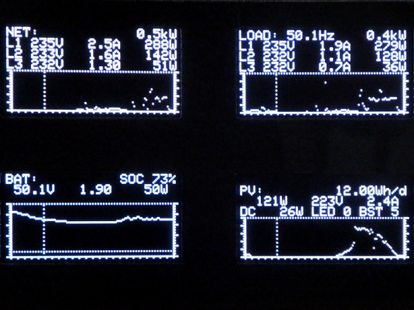

# OLED Monitor showing MQTT data

## Some infos

I had some spare monochrome OLED displays from an old project. OLED display are are getting cheaper. They need less power, are brighter and have a greater temperature range then LCDs.

The displays are used to show MQTT data from my new Energy Storage System (ESS) from Victron (3 phase 24&#8239;kVA). More infos soon on <http://www.prosumer.lu>.

## All infos on: <http://www.weigu.lu/microcontroller/mqtt_oled_mon/index.html>
